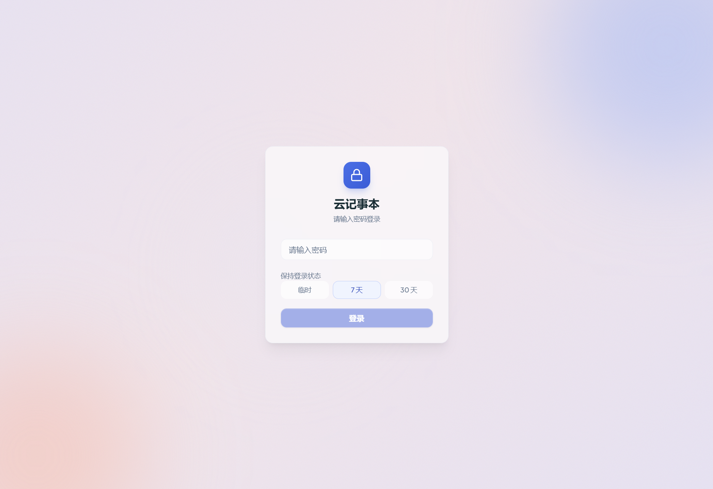
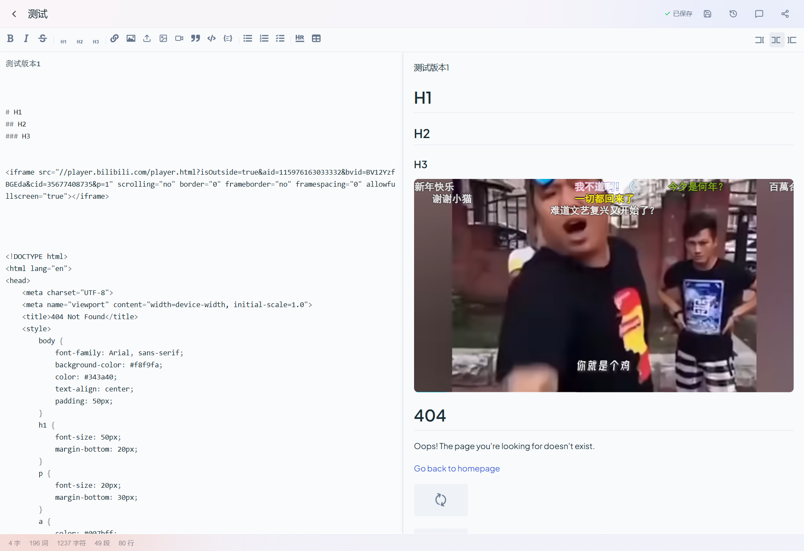

<div align="center">

# InkPad

**Self-hosted Markdown note-taking app with real-time sync, multi-platform deployment, and passwordless login.**

[](./LICENSE)
[](https://ghcr.io/eyte112/inkpad)

[Features](#features) · [Screenshots](#screenshots) · [Quick Start](#quick-start) · [Deployment](#deployment) · [Development](#development)

<a href="./README.md">中文文档</a>

</div>

---

## Features

| | Feature | Description |
|---|---------|-------------|
| :pencil2: | **Markdown Editor** | Real-time preview powered by [@uiw/react-md-editor](https://github.com/uiwjs/react-md-editor) |
| :floppy_disk: | **Auto-save** | 2s debounce + optimistic locking + conflict detection & merge |
| :framed_picture: | **Multi Image Hosting** | Upload to GitHub / S.EE / Imgur / R2 via backend proxy |
| :link: | **Note Sharing** | Short links with optional password protection |
| :key: | **Passwordless Login** | WebAuthn Passkey (pure Web Crypto, no server-side deps) |
| :crescent_moon: | **Dark Mode** | System-aware with manual toggle |
| :label: | **Tags & Search** | Organize and find notes quickly |
| :clock3: | **Version History** | Auto-saves every edit, view and restore any previous version |
| :bulb: | **Edit Suggestions** | Visitors can submit suggestions on shared notes, author reviews and accepts |
| :globe_with_meridians: | **Multi-platform** | Deploy anywhere with unified KV abstraction |

### Roadmap

- Custom share link slugs
- Share link expiration settings
- Note export (PDF / HTML / Markdown bundle download)
- Burn after reading (auto-destroy shared content after viewing)
- End-to-end encryption (client-side encryption, zero-knowledge server)

## Screenshots

<p align="center">
  
</p>
<p align="center">
  
</p>
<p align="center">
  
</p>
<p align="center">
  
</p>

## Tech Stack

| Layer | Technology |
|:------|:-----------|
| **Frontend** | React 19 · TypeScript · Vite 7 · Tailwind CSS 4 |
| **State** | Zustand 5 · TanStack Query 5 |
| **UI** | Radix UI · Lucide React |
| **Backend** | Platform-agnostic handlers (TypeScript) |
| **Storage** | Unified KV interface (`IKVStore`) |
| **VPS Runtime** | Hono · better-sqlite3 |

## Quick Start

### Docker (Recommended)

```bash
docker run -d \
  --name inkpad \
  -p 3000:3000 \
  -v inkpad-data:/app/data \
  ghcr.io/eyte112/inkpad:latest
```

Open `http://localhost:3000`, set your password on first visit.

### Docker Compose

```yaml
services:
  inkpad:
    image: ghcr.io/eyte112/inkpad:latest
    ports:
      - "3000:3000"
    volumes:
      - inkpad-data:/app/data
    restart: unless-stopped

volumes:
  inkpad-data:
```

## Deployment

### Option 1: VPS / Docker (Recommended)

Data is persisted in SQLite within the Docker Volume at `/app/data/inkpad.db`.

Docker images are automatically built and published to GHCR by GitHub Actions on every push to `main` or version tag.

| Env Variable | Description | Default |
|:-------------|:------------|:--------|
| `PORT` | Server port | `3000` |
| `DB_PATH` | SQLite database path | `./data/inkpad.db` |
| `CORS_ORIGINS` | Allowed CORS origins (comma-separated) | Same-origin only |

<details>
<summary><b>Reverse Proxy (Nginx example)</b></summary>

```nginx
server {
    listen 443 ssl;
    server_name notes.example.com;

    ssl_certificate     /path/to/cert.pem;
    ssl_certificate_key /path/to/key.pem;

    location / {
        proxy_pass http://127.0.0.1:3000;
        proxy_set_header Host $host;
        proxy_set_header X-Real-IP $remote_addr;
        proxy_set_header X-Forwarded-For $proxy_add_x_forwarded_for;
        proxy_set_header X-Forwarded-Proto $scheme;
        client_max_body_size 10m;
    }
}
```

</details>

<details>
<summary><b>Data Backup</b></summary>

```bash
# Backup
docker cp inkpad:/app/data/inkpad.db ./inkpad-backup.db

# Restore
docker cp ./inkpad-backup.db inkpad:/app/data/inkpad.db
docker restart inkpad
```

</details>

### Option 2: EdgeOne Pages

Click the button below to deploy to EdgeOne Pages with one click:

<a href="https://edgeone.ai/pages/new?repository-url=https%3A%2F%2Fgithub.com%2Feyte112%2Finkpad" target="_blank" rel="noopener noreferrer"></a>

Or deploy manually:

1. Fork or push the code to GitHub
2. Log in to [EdgeOne Pages Console](https://edgeone.ai/pages), click "New Project", and import the GitHub repository
3. Build settings:
   - Build command: `npm run build`
   - Output directory: `dist`
4. Create and bind a KV namespace:
   - Go to project "Settings" → "KV Storage"
   - Create a new KV namespace (any name, e.g. `inkpad-kv`)
   - **The binding variable name must be uppercase `KV`** (code accesses it via `declare const KV`)
5. Trigger a redeployment and wait for the build to complete

> **Note**: The KV variable name is case-sensitive. Using `kv` or `Kv` will cause 500 errors.

### Option 3: Cloudflare Workers

Click the button below to deploy to Cloudflare Workers with one click:

<a href="https://deploy.workers.cloudflare.com/?url=https://github.com/eyte112/inkpad" target="_blank" rel="noopener noreferrer"></a>

Or deploy manually:

1. Install Wrangler CLI and log in:
   ```bash
   npm i -g wrangler
   wrangler login
   ```
2. Build the frontend:
   ```bash
   npm install
   npm run build
   ```
3. Create a KV namespace:
   ```bash
   wrangler kv namespace create KV
   # Note the returned id, e.g.: { id: "xxxxxxxxxxxx" }
   ```
4. Edit `wrangler.jsonc` in the project root and replace the `id` in `kv_namespaces` with the value from the previous step:
   ```jsonc
   "kv_namespaces": [
     { "binding": "KV", "id": "your-actual-namespace-id" }
   ]
   ```
5. Deploy:
   ```bash
   npx wrangler deploy
   ```

> **Note**: The Cloudflare config file is `wrangler.jsonc` (not `.toml`) in the project root.

### Option 4: Vercel

[](https://vercel.com/new/clone?repository-url=https%3A%2F%2Fgithub.com%2Feyte112%2Finkpad)

Or deploy manually:

1. Fork or push the code to GitHub
2. Log in to [Vercel](https://vercel.com), click "Add New Project", and import the GitHub repository
3. Create an Upstash Redis database:
   - In the Vercel project "Storage" tab, click "Create Database" → select "Upstash KV"
   - Environment variables will be injected automatically (`KV_REST_API_URL`, `KV_REST_API_TOKEN`)
4. Trigger a redeployment and wait for the build to complete

> **Note**: If configuring Upstash manually, both `KV_REST_API_URL` / `KV_REST_API_TOKEN` and `UPSTASH_REDIS_REST_URL` / `UPSTASH_REDIS_REST_TOKEN` naming conventions are supported.

## Architecture

```
src/           -> Frontend React SPA
functions/     -> Backend handlers (platform-agnostic)
  ├── api/     -> REST API routes
  └── shared/  -> Auth, KV abstraction, unified router
server/        -> VPS entry (Hono + SQLite)
platforms/     -> Other platform entries
  ├── cloudflare/  -> Cloudflare Workers entry
  └── vercel/      -> Vercel KV adapter
api/           -> Vercel Serverless Function entry
```

> **KV Abstraction** — Business logic talks to `IKVStore` interface. Platform adapters (EdgeOne KV, SQLite, Cloudflare Workers, etc.) implement it. Add a new platform by implementing the interface + creating an entry file.

## Development

```bash
git clone https://github.com/eyte112/inkpad.git
cd inkpad
npm install

# VPS mode (full-stack, local SQLite)
npm run dev:server

# Frontend only (needs deployed backend)
npm run dev
```

<details>
<summary><b>All Commands</b></summary>

```bash
npm run build          # Frontend production build
npm run build:server   # Backend production build
npm run start:server   # Production start
npm run lint           # ESLint check
npm run format         # Prettier format
```

</details>

## Contributing

1. Fork the repository
2. Create your feature branch (`git checkout -b feat/amazing-feature`)
3. Commit your changes (`git commit -m 'feat: add amazing feature'`)
4. Push to the branch (`git push origin feat/amazing-feature`)
5. Open a Pull Request

## License

[AGPL-3.0](./LICENSE)
